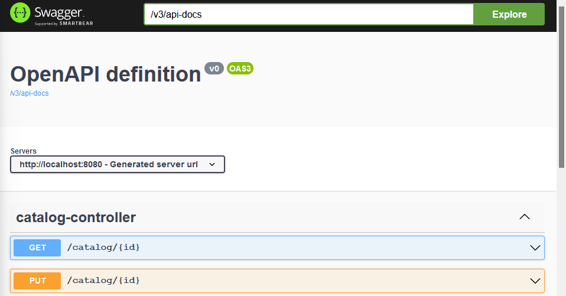
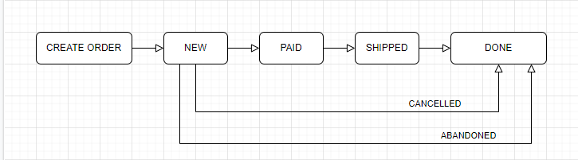

# Honey

This is an interactive shop site, where you can buy honey related things.

Made by me, mostly for me. One day we may go live, cause my family owns a bee-garden.

## Use

This will be deployed with use of Heroku.

For now you can download the APP and use it.

## Postgres Database

This web application uses Postgres Database.

To run it use:

1) cd docker (to get inside of /docker/ folder)
2) docker-compose up -d (to run our database configured in docker-compose.yml)
3) Connect your IDE to the database using ports and login stated in docker-compose.yml

## Swagger - API Documentation

The REST API was documented and can be found here: https://rojberr.github.io/honey-swagger/
The documentation was created using SpringFox Boot Starter tool.

Another dependency was added, and not Swagger Honey API documentation can be accessed after launching the application
and typing: http://localhost:8080/swagger-ui/index.html#/ in your browser address field. :)

# ORDER FLOW

To manage our shop orders we create order steps, which can be changed only in defined directions. The graph below
illustrates the idea.

THis represents a small state maschine.

- NEW - This represents a new order. It can be either cancelled, abandoned or paid (in a given period of time!).
- PAID - It can be only shipped.
- SHIPPED - from here the order is acknowledged as done.

To cancel an order you can use a http REST point, created specially for that. To abandon the order a specified time
amount needs to be exceeded.

If the oder is cancelled or abandoned the reserved amount of Honey products are released and saved in the database.

## Tests

User tests include:

1) Ordering honey products and checking if the available amount decreases
2) Cancelling a NEW order
3) Ordering more products than available (should fail)
4) Ordering not available products (with wrong id - should fail)
5) Ordering negative amount of products (should fail)
6) Cancelling order of someone else (should fail)

Admin tests include:

1) Cancelling client's order
2) Changing user's order as PAID (amount of available decreases)
3) Automatically cancelling unpaid orders

## TODO

1) ...

## UML

## Changes